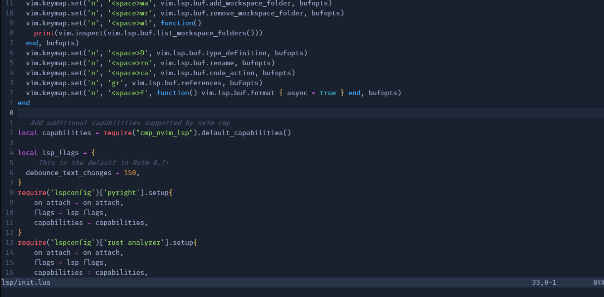

# Neovim Configuration


Welcome to my Neovim configuration! Neovim is a modern, improved version of the popular text editor Vim. This configuration includes a variety of plugins and settings to enhance your Neovim experience.

Some of the notable features of this configuration include:
* A beautiful [One Dark](https://github.com/navarasu/onedark.nvim) color scheme that is easy on the eyes and easy to read.
* File navigation made easy with [nvim-tree](https://github.com/nvim-tree/nvim-tree.lua).
* Support for the [Language Server Protocol (LSP)](https://github.com/neovim/nvim-lspconfig) with the following plugins:
  * [lsp-auto-complete](https://github.com/neovim/nvim-lspconfig/wiki/Autocompletion) for intelligent code completion.
  * [lsp-kind](https://github.com/onsails/lspkind.nvim) for displaying information about symbols in your code.

### Installing this Configuration
To install this configuration on your system, follow these steps:

1. Make sure you have Neovim installed and set up. If you don't have Neovim, you can follow the instructions here.
2. Clone this repository to your local machine. 
```git clone https://github.com/jrzvnn/nvim.git```
3. Copy the nvim folder to `~/.config` directory. 
4. Install the required plugins using Packer. In Neovim, run the following command:
`:PackerSync`
5. Restart Neovim. The One Dark color scheme and other features of this configuration should now be available.